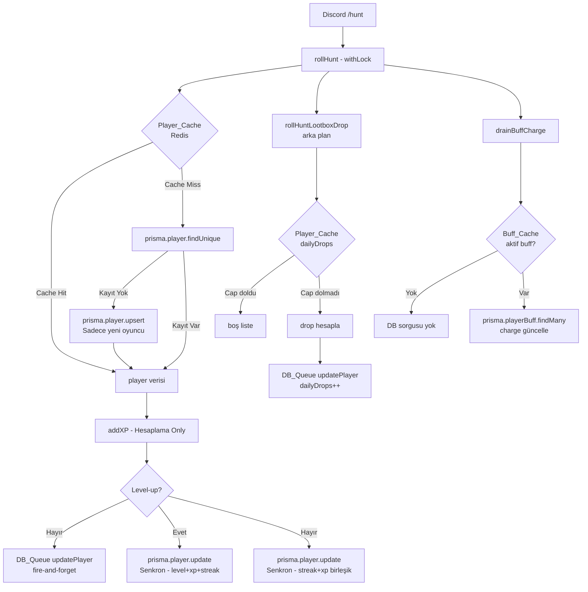

# Tasarım Belgesi: BaykusBot Performans Optimizasyonu

## Genel Bakış

BaykusBot, Discord üzerinde çalışan bir oyun botudur. Oyuncular `/hunt` komutuyla av turu başlatır; bu tur sırasında MongoDB (Prisma), Redis (ioredis) ve BullMQ iş kuyruğu katmanları devreye girer.

Kod analizi, kritik yolda (kullanıcı Discord cevabını beklerken geçen senkron akış) gereksiz MongoDB round-trip'leri tespit etmiştir. Mevcut akışta tek bir hunt turu için kritik yolda **4–6 MongoDB round-trip** gerçekleşmektedir. Bu tasarım, söz konusu sayıyı **en fazla 2**'ye (player okuma + birleşik yazma) indirmeyi hedefler.

### Hedef Metrik

| Durum | Mevcut Round-Trip | Hedef Round-Trip |
|---|---|---|
| Cache hit, buff yok, level-up yok | 4 | 1 |
| Cache hit, buff var, level-up yok | 4 | 2 |
| Cache miss, buff yok, level-up yok | 5 | 2 |
| Cache miss, buff var, level-up var | 6 | 3 |

> Baykuş bond güncellemesi bu sayıma dahil değildir; mevcut paralel yapıda kalır.

### Kapsam

- `src/systems/hunt.ts` — `rollHunt`
- `src/systems/xp.ts` — `addXP`
- `src/systems/drops.ts` — `tryClaimDailyDrop`, `rollHuntLootboxDrop`
- `src/systems/items.ts` — `drainBuffCharge`
- `src/utils/player-cache.ts` — `CachedPlayerData`, `getPlayerBundle`

**Kapsam dışı:** Yeni oyun mekaniği, Discord API değişikliği, altyapı ölçeklendirmesi.

---

## Mimari

### Mevcut Akış (Sorunlu)

```
Discord → rollHunt
  ├── prisma.player.upsert          [RT-1: her zaman DB]
  ├── prisma.owl.findUnique         [RT-2]
  ├── getBuffEffects (cache miss)   [RT-3: opsiyonel]
  ├── addXP
  │   └── prisma.player.update      [RT-4: XP yazma]
  ├── prisma.player.update          [RT-5: streak yazma]
  └── tryClaimDailyDrop
      ├── prisma.player.findUnique  [RT-6: günlük sayaç okuma]
      └── prisma.player.update      [RT-7: günlük sayaç yazma]
```

### Hedef Akış (Optimize)

```
Discord → rollHunt
  ├── getPlayerBundle (Redis cache-first)  [RT-1: sadece cache miss]
  ├── prisma.owl.findUnique                [RT-2: paralel, değişmez]
  ├── getBuffEffects (in-memory cache)     [RT-3: sadece cache miss]
  │
  ├── addXP (hesaplama only, DB yok)       [RT: 0]
  │
  ├── prisma.player.update (BİRLEŞİK)     [RT-2: streak+xp+level tek yazma]
  │
  └── rollHuntLootboxDrop (arka plan)
      └── günlük sayaç → Player_Cache     [RT: 0 kritik yolda]
          └── DB_Queue'ya yazma           [fire-and-forget]
```

### Katman Diyagramı



---

## Bileşenler ve Arayüzler

### 1. Player_Cache Genişletmesi (`src/utils/player-cache.ts`)

`CachedPlayerData` arayüzüne günlük lootbox drop alanları eklenir:

```typescript
export interface CachedPlayerData {
  id: string;
  level: number;
  xp: number;
  coins: number;
  huntComboStreak: number;
  noRareStreak: number;
  mainOwlId: string | null;
  // YENİ: günlük lootbox drop takibi
  dailyLootboxDrops: number;
  lastLootboxDropDate: string | null; // ISO string (Date JSON serialize)
}
```

`getPlayerBundle` fonksiyonu bu alanları DB'den çekerken `select` listesine ekler.

### 2. Hunt_System Değişiklikleri (`src/systems/hunt.ts`)

#### 2a. Player Okuma: upsert → cache-first

```typescript
// ÖNCE (her zaman DB round-trip):
const player = await prisma.player.upsert({ where: { id: playerId }, ... });

// SONRA (cache-first):
let bundle = await getPlayerBundle(redis, prisma, playerId);
if (!bundle) {
  // Yeni oyuncu: upsert + cache'e yaz
  const newPlayer = await prisma.player.upsert({ ... });
  bundle = buildBundle(newPlayer, null);
  await setCachedPlayerBundle(redis, playerId, bundle);
}
const player = bundle.player;
```

#### 2b. Birleşik Player Yazma

Mevcut kodda `addXP` içinde bir `prisma.player.update` + `rollHunt` içinde ayrı bir `prisma.player.update` (streak) yapılmaktadır. Bu iki yazma tek bir çağrıya indirilir:

```typescript
// addXP artık DB yazmaz, sadece hesaplama yapar:
const xpResult = computeXP(player, totalXP); // saf fonksiyon

// rollHunt tek birleşik yazma yapar:
if (xpResult.levelUp) {
  await prisma.player.update({
    where: { id: playerId },
    data: {
      huntComboStreak: newStreak,
      noRareStreak: newNoRareStreak,
      lastHunt: new Date(),
      level: xpResult.levelUp.newLevel,
      xp: 0,
    },
  });
} else {
  await prisma.player.update({
    where: { id: playerId },
    data: {
      huntComboStreak: newStreak,
      noRareStreak: newNoRareStreak,
      lastHunt: new Date(),
      xp: xpResult.currentXP,
    },
  });
}
```

### 3. XP_System Değişiklikleri (`src/systems/xp.ts`)

`addXP` fonksiyonu iki moda ayrılır:

- **Hesaplama modu** (Hunt_System tarafından kullanılır): DB yazmaz, sadece `XpApplyResult` döndürür.
- **Bağımsız mod** (diğer sistemler tarafından kullanılır): Mevcut davranışı korur.

Geriye dönük uyumluluk için fonksiyon imzası değişmez; `skipDbWrite` opsiyonel parametresi eklenir:

```typescript
export async function addXP(
  prisma: PrismaClient,
  playerId: string,
  amount: number,
  source: string,
  existingPlayer?: { level: number; xp: number },
  skipDbWrite?: boolean,  // YENİ: Hunt_System true geçer
): Promise<XpApplyResult>
```

`skipDbWrite = true` olduğunda:
- Level-up yoksa: DB_Queue'ya `updatePlayer` job'ı eklenir (fire-and-forget)
- Level-up varsa: senkron `prisma.player.update` yapılır (level değişimi kritik)

> **Tasarım kararı:** Level-up durumunda senkron yazma zorunludur çünkü level değeri sonraki komutlarda (pvp, upgrade) doğrudan okunur ve yanlış level ile hesaplama yapılması oyun dengesini bozar.

### 4. Drop_System Değişiklikleri (`src/systems/drops.ts`)

`tryClaimDailyDrop` fonksiyonu Player_Cache'i kullanacak şekilde yeniden yazılır:

```typescript
async function tryClaimDailyDrop(
  prisma: PrismaClient,
  redis: Redis,
  playerId: string,
  cachedPlayer: CachedPlayerData,  // YENİ: cache'den gelen veri
): Promise<boolean>
```

- Günlük sayaç `cachedPlayer.dailyLootboxDrops` ve `cachedPlayer.lastLootboxDropDate` üzerinden okunur.
- Cap kontrolü senkron (DB yok).
- Drop gerçekleşirse DB_Queue'ya `updatePlayer` job'ı eklenir (fire-and-forget).
- `rollHuntLootboxDrop` imzası `redis` ve `cachedPlayer` parametrelerini alacak şekilde güncellenir.

### 5. Drain_System Değişiklikleri (`src/systems/items.ts`)

`drainBuffCharge` fonksiyonu Buff_Cache'i kontrol edecek şekilde güncellenir:

```typescript
export async function drainBuffCharge(
  prisma: AnyPrisma,
  playerId: string,
  activityType: 'hunt' | 'pvp' | 'upgrade',
): Promise<void>
```

Değişiklik: Fonksiyon başında `buffCache` Map'i kontrol eder. İlgili kategori için cache'de kayıt varsa ve tüm `effectValue` değerleri sıfırsa (aktif buff yok), `findMany` çağrısı atlanır.

```typescript
// Buff_Cache kontrolü — aktif buff yoksa DB'ye gitme
const cacheKey = `${playerId}:${activityType}`;
const cached = buffCache.get(cacheKey);
if (cached && cached.expiresAt > Date.now()) {
  const hasActiveBuff = cached.effects.catchBonus > 0
    || cached.effects.lootMult > 1.0
    || /* diğer effect alanları */ false;
  if (!hasActiveBuff) return; // DB sorgusu yok
}
```

Charge güncellemesi sonrası `buffCache.delete(cacheKey)` çağrılır (mevcut davranış korunur).

---

## Veri Modelleri

### CachedPlayerData (Genişletilmiş)

```typescript
export interface CachedPlayerData {
  id: string;
  level: number;
  xp: number;
  coins: number;
  huntComboStreak: number;
  noRareStreak: number;
  mainOwlId: string | null;
  dailyLootboxDrops: number;        // YENİ
  lastLootboxDropDate: string | null; // YENİ — ISO 8601 string
}
```

**Neden string?** Redis JSON serialize/deserialize sırasında `Date` nesneleri string'e dönüşür. Tutarlılık için `lastLootboxDropDate` baştan `string | null` olarak tanımlanır; karşılaştırma `new Date(str).toDateString()` ile yapılır.

### XpApplyResult (Değişmez)

```typescript
export interface XpApplyResult {
  gainedXP: number;
  currentXP: number;
  currentLevel: number;
  levelUp?: {
    oldLevel: number;
    newLevel: number;
    remainingXP: number;
  };
}
```

`addXP` imzası değişmez; dönüş tipi aynı kalır. `skipDbWrite = true` olduğunda hesaplanan değerler DB beklenmeden döndürülür.

### DB_Queue Job Tipleri (Değişmez)

Mevcut `UpdatePlayerJob` tipi tüm yeni alanları (`xp`, `huntComboStreak`, `noRareStreak`, `lastHunt`, `dailyLootboxDrops`, `lastLootboxDropDate`) `data: Record<string, unknown>` alanı üzerinden destekler. Yeni job tipi gerekmez.

### Prisma Schema (Değişmez)

`Player` modeline `dailyLootboxDrops` ve `lastLootboxDropDate` alanları zaten mevcuttur (`drops.ts` içindeki mevcut `findUnique` sorgusu bu alanları seçmektedir). Schema değişikliği gerekmez.

---

## Doğruluk Özellikleri

*Bir özellik (property), bir sistemin tüm geçerli çalışmalarında doğru olması gereken bir karakteristik veya davranıştır — özünde, sistemin ne yapması gerektiğine dair biçimsel bir ifadedir. Özellikler, insan tarafından okunabilir spesifikasyonlar ile makine tarafından doğrulanabilir doğruluk garantileri arasındaki köprüyü oluşturur.*

### Özellik 1: Player Cache Round-Trip Azaltımı

*Her* geçerli oyuncu için, Player_Cache'de kayıt bulunduğunda `rollHunt` çağrısı sırasında `player` tablosuna yönelik MongoDB sorgusu gönderilmemelidir.

**Doğrular: Gereksinim 1.2**

### Özellik 2: Yeni Oyuncu Upsert Koşulluluğu

*Her* oyuncu kimliği için, Player_Cache'de kayıt varsa `prisma.player.upsert` çağrısı yapılmamalıdır; upsert yalnızca hem cache miss hem de DB miss durumunda gerçekleşmelidir.

**Doğrular: Gereksinim 1.4, 1.5**

### Özellik 3: XP Hesaplama Tutarlılığı

*Her* geçerli `(level, xp, amount)` üçlüsü için, `addXP` fonksiyonunun döndürdüğü `gainedXP`, `currentXP` ve `currentLevel` değerleri, DB yazma işleminin gerçekleşip gerçekleşmediğinden bağımsız olarak aynı olmalıdır.

**Doğrular: Gereksinim 4.3**

### Özellik 4: Birleşik Yazma Bütünlüğü

*Her* hunt turu için, level-up gerçekleşmediğinde `huntComboStreak`, `noRareStreak`, `lastHunt` ve `xp` alanları tek bir `prisma.player.update` çağrısında yazılmalı; bu alanlar için ikinci bir `update` çağrısı yapılmamalıdır.

**Doğrular: Gereksinim 5.1, 5.3**

### Özellik 5: Günlük Drop Cap Koruması

*Her* oyuncu için, `dailyLootboxDrops` değeri `DAILY_DROP_CAP` değerine ulaştığında, aynı gün içinde yapılan sonraki hunt turlarında lootbox drop hesaplaması atlanmalı ve boş liste döndürülmelidir.

**Doğrular: Gereksinim 2.4**

### Özellik 6: Buff Yokken Sıfır DB Round-Trip

*Her* oyuncu için, Buff_Cache'de ilgili kategori için aktif buff bulunmadığı bilgisi mevcutsa, `drainBuffCharge` çağrısı sırasında MongoDB'ye sorgu gönderilmemelidir.

**Doğrular: Gereksinim 3.2, 3.5**

### Özellik 7: Graceful Degradation

*Her* Redis bağlantı hatası senaryosunda, `getPlayerBundle` fonksiyonu hata fırlatmak yerine MongoDB'den okuma yaparak geçerli bir `CachedPlayerBundle` döndürmelidir.

**Doğrular: Gereksinim 6.6**

---

## Hata Yönetimi

### Redis Bağlantı Hatası

Mevcut `try/catch` yapısı korunur. `getCachedPlayerBundle`, `setCachedPlayerBundle` ve `invalidatePlayerCache` fonksiyonları Redis hatalarını sessizce yutar ve `null` / `void` döndürür. `getPlayerBundle` bu durumda MongoDB'ye fallback yapar.

`tryClaimDailyDrop` içindeki Redis okuma hatası durumunda: cap kontrolü için MongoDB'ye fallback yapılır (mevcut `findUnique` davranışı). Bu, graceful degradation'ı korur.

### DB_Queue Dolu / Erişilemiyor

`enqueueDbWrite` içindeki mevcut `console.warn` + direkt yazma fallback'i korunur. XP güncellemesi queue'ya eklenemezse, `addXP` içinde senkron `prisma.player.update` yapılır (mevcut davranışa geri döner).

### Level-Up Senkron Yazma Hatası

Level-up durumunda `prisma.player.update` başarısız olursa hata yukarı fırlatılır (mevcut davranış). Bu kritik bir durumdur; oyuncunun level'ı yanlış kalmamalıdır.

### Yeni Oyuncu Upsert Hatası

`prisma.player.upsert` başarısız olursa hata yukarı fırlatılır. Yeni oyuncu oluşturulamadan hunt devam edemez.

### Buff Cache Tutarsızlığı

Buff_Cache 30 saniyelik TTL ile çalışır. `drainBuffCharge` sonrası `buffCache.delete` çağrısı yapılır. TTL süresi dolmadan cache invalidate edildiği için tutarsızlık penceresi kapatılır.

---

## Test Stratejisi

### Birim Testleri

Her değiştirilen fonksiyon için örnek tabanlı birim testleri yazılır:

- `addXP` — `skipDbWrite=true` ile level-up olmayan durumda DB çağrısı yapılmadığını doğrula
- `addXP` — `skipDbWrite=true` ile level-up durumunda senkron DB çağrısı yapıldığını doğrula
- `tryClaimDailyDrop` — cache'den okunan cap değeri ile doğru karar verildiğini doğrula
- `drainBuffCharge` — Buff_Cache'de aktif buff yokken `findMany` çağrılmadığını doğrula
- `getPlayerBundle` — Redis hatası durumunda MongoDB'ye fallback yapıldığını doğrula

### Özellik Tabanlı Testler (fast-check)

Bu özellik, TypeScript tabanlı bir Discord botu olduğundan **fast-check** kütüphanesi kullanılır. Her özellik testi minimum 100 iterasyon çalıştırılır.

Test etiketi formatı: `Feature: bot-performance-optimization, Property {N}: {özellik_metni}`

#### Özellik 3: XP Hesaplama Tutarlılığı

```typescript
// Feature: bot-performance-optimization, Property 3: XP hesaplama tutarlılığı
fc.assert(fc.asyncProperty(
  fc.record({
    level: fc.integer({ min: 1, max: 100 }),
    xp: fc.integer({ min: 0, max: 10000 }),
    amount: fc.integer({ min: 1, max: 500 }),
  }),
  async ({ level, xp, amount }) => {
    const resultWithDb = await addXP(mockPrisma, 'p1', amount, 'hunt', { level, xp }, false);
    const resultSkipDb = await addXP(mockPrisma, 'p1', amount, 'hunt', { level, xp }, true);
    expect(resultSkipDb.gainedXP).toBe(resultWithDb.gainedXP);
    expect(resultSkipDb.currentXP).toBe(resultWithDb.currentXP);
    expect(resultSkipDb.currentLevel).toBe(resultWithDb.currentLevel);
  }
), { numRuns: 100 });
```

#### Özellik 5: Günlük Drop Cap Koruması

```typescript
// Feature: bot-performance-optimization, Property 5: Günlük drop cap koruması
fc.assert(fc.asyncProperty(
  fc.record({
    dailyLootboxDrops: fc.integer({ min: 5, max: 20 }),
    lastLootboxDropDate: fc.constant(new Date().toISOString()),
    level: fc.integer({ min: 1, max: 100 }),
    isCritical: fc.boolean(),
  }),
  async ({ dailyLootboxDrops, lastLootboxDropDate, level, isCritical }) => {
    const cachedPlayer = buildCachedPlayer({ dailyLootboxDrops, lastLootboxDropDate });
    const drops = await rollHuntLootboxDrop(mockPrisma, mockRedis, 'p1', level, isCritical, cachedPlayer);
    expect(drops).toHaveLength(0);
  }
), { numRuns: 100 });
```

#### Özellik 7: Graceful Degradation

```typescript
// Feature: bot-performance-optimization, Property 7: Graceful degradation
fc.assert(fc.asyncProperty(
  fc.string(), // playerId
  async (playerId) => {
    const brokenRedis = buildBrokenRedis(); // her çağrıda hata fırlatır
    const result = await getPlayerBundle(brokenRedis, mockPrisma, playerId);
    // Redis hatası olsa bile null veya geçerli bundle döner, hata fırlatmaz
    expect(() => result).not.toThrow();
  }
), { numRuns: 100 });
```

### Entegrasyon Testleri

- Hunt turu başına MongoDB round-trip sayısını ölçen entegrasyon testi (Prisma mock ile spy)
- Redis down senaryosunda tam hunt akışının tamamlandığını doğrulayan test

### Regresyon Testleri

Mevcut hunt davranışının değişmediğini doğrulamak için:
- Catch/escape/injured sonuçları aynı seed ile aynı çıktıyı üretmeli
- Level-up sonrası `currentLevel` doğru olmalı
- Streak değerleri doğru hesaplanmalı
