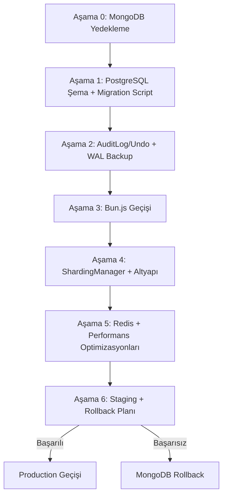
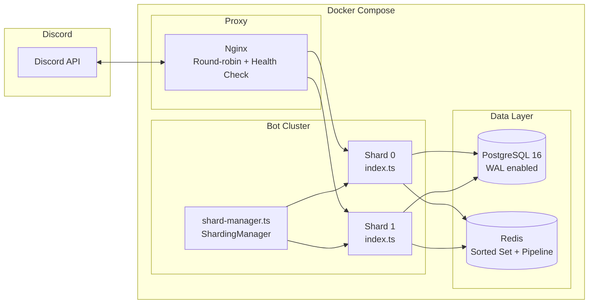
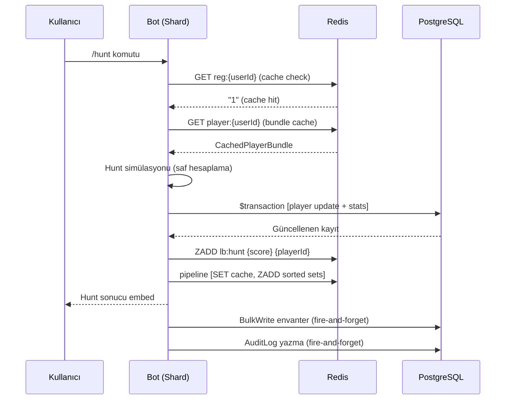

# Tasarım Belgesi: MongoDB → PostgreSQL + Bun.js Geçişi

## Genel Bakış

Bu belge, OwlHuntBot Discord botunun MongoDB tabanlı altyapısından PostgreSQL + Bun.js tabanlı yüksek performanslı mimariye geçişinin teknik tasarımını tanımlar. Geçiş altı aşamada gerçekleştirilir: veri yedekleme, şema geçişi, denetim sistemi, Bun.js çalışma zamanı geçişi, altyapı optimizasyonları ve staging/rollback planı.

### Temel Hedefler

- **Sıfır veri kaybı**: Tüm MongoDB verileri PostgreSQL'e eksiksiz aktarılır
- **Geri alınabilirlik**: Her aşama bağımsız olarak geri alınabilir
- **Performans iyileştirmesi**: Bun.js, Redis pipeline, Sorted Set ve transaction optimizasyonları ile yanıt süresi düşürülür
- **Operasyonel güvenilirlik**: ShardingManager, Nginx health check, Docker Compose ile production-grade dağıtım

### Teknoloji Yığını Değişimi

| Bileşen | Öncesi | Sonrası |
|---|---|---|
| Veritabanı | MongoDB (Atlas M0) | PostgreSQL 16 |
| ORM | Prisma (MongoDB provider) | Prisma (PostgreSQL provider) |
| Çalışma zamanı | Node.js 20 + tsx | Bun.js 1.x |
| Paket yöneticisi | pnpm | Bun |
| Env yükleme | dotenv | Bun yerleşik |
| Shard yönetimi | Tek process | ShardingManager |
| Önbellek | Redis (temel) | Redis (pipeline + Sorted Set + Lua) |

---

## Mimari

### Geçiş Aşamaları



### Hedef Mimari



### Veri Akışı: Hunt İşlemi (Optimizasyon Sonrası)



---

## Bileşenler ve Arayüzler

### Aşama 0: Yedekleme Betiği

**Dosya:** `src/scripts/backup-mongodb.ts`

```typescript
interface BackupResult {
  collection: string;
  count: number;
  filePath: string;
  timestamp: string;
}

interface BackupReport {
  results: BackupResult[];
  totalCollections: number;
  totalRecords: number;
  backupDir: string;
  completedAt: string;
}

// Dosya adı formatı: {collection}_{ISO_TIMESTAMP}.json
// Örnek: Player_2025-01-15T00-00-00Z.json
function buildBackupFileName(collection: string, timestamp: Date): string

async function backupCollection(
  mongoClient: MongoClient,
  dbName: string,
  collection: string,
  outputDir: string,
  timestamp: Date,
): Promise<BackupResult>

async function runBackup(outputDir: string): Promise<BackupReport>
```

**Desteklenen collection'lar:** `Player`, `Owl`, `InventoryItem`, `PvpSession`, `Encounter`, `PlayerRegistration`, `SeasonArchive`, `Season`

### Aşama 1: Migration Betiği

**Dosya:** `src/scripts/migrate-mongodb-to-pg.ts`

```typescript
interface MigrationResult {
  model: string;
  mongoCount: number;
  pgCount: number;
  matched: boolean;
}

interface MigrationReport {
  results: MigrationResult[];
  success: boolean;
  completedAt: string;
}

// MongoDB _id → PostgreSQL id dönüşümü
function transformDocument<T extends { _id?: string; id?: string }>(doc: T): Omit<T, '_id'> & { id: string }

// Kayıt sayısı karşılaştırma
function compareRecordCounts(mongoCount: number, pgCount: number): { matched: boolean; discrepancy: number }

async function migrateCollection<T>(
  mongoCollection: Collection<T>,
  pgInsertFn: (records: T[]) => Promise<number>,
): Promise<MigrationResult>

async function runMigration(): Promise<MigrationReport>
```

**Aktarım sırası** (foreign key bağımlılıkları nedeniyle):
1. `Season` (bağımsız)
2. `Player` (bağımsız)
3. `Owl` (Player'a bağımlı)
4. `InventoryItem` (Player'a bağımlı)
5. `PlayerRegistration` (Player'a bağımlı)
6. `PlayerBuff` (Player'a bağımlı)
7. `PvpSession` (Player'a bağımlı)
8. `Encounter` (Player'a bağımlı)
9. `SeasonArchive` (Player'a bağımlı)
10. `MarketListing` (Player'a bağımlı)
11. `DailyQuest` (Player'a bağımlı)

### Aşama 2: AuditLog Sistemi

**Dosya:** `src/utils/audit.ts`

```typescript
interface AuditEntry {
  playerId: string;
  action: string;
  before: Record<string, unknown>;
  after: Record<string, unknown>;
}

// AuditLog kaydı yazar
async function writeAudit(
  prisma: PrismaClient,
  playerId: string,
  action: string,
  before: Record<string, unknown>,
  after: Record<string, unknown>,
): Promise<void>

// Son eylemi geri alır
async function undoLastAction(
  prisma: PrismaClient,
  playerId: string,
): Promise<{ action: string; restoredState: Record<string, unknown> }>

// 30 günden eski kayıtları temizler
async function cleanupOldAuditLogs(prisma: PrismaClient): Promise<number>
```

**Prisma AuditLog modeli:**
```prisma
model AuditLog {
  id        String   @id @default(uuid())
  playerId  String
  action    String
  before    Json
  after     Json
  createdAt DateTime @default(now())

  @@index([playerId, createdAt])
}
```

### Aşama 3: Bun.js Geçişi

**Değiştirilecek dosyalar:**

| Dosya | Değişiklik |
|---|---|
| `src/index.ts` | `import 'dotenv/config'` kaldır; `pathToFileURL` → `import.meta.dir` |
| `src/shard.ts` | `import 'dotenv/config'` kaldır; `shard-manager.ts` olarak yeniden adlandır |
| `tsconfig.json` | `"module": "ESNext"`, `"moduleResolution": "bundler"`, `"types": ["bun-types"]` |
| `package.json` | `dotenv` bağımlılığını kaldır; `bun-types` ekle |
| `src/systems/leaderboard.ts` | Dinamik `await import(...)` → statik `import` |

**Komut yükleme (Bun uyumlu):**
```typescript
// Öncesi (Node.js)
const moduleUrl = pathToFileURL(join(commandsDir, fileName)).href;
const mod = await import(moduleUrl);

// Sonrası (Bun)
const commandsDir = join(import.meta.dir, '..', 'commands');
const mod = await import(join(commandsDir, fileName));
```

### Aşama 4: Altyapı Bileşenleri

**`src/shard-manager.ts`** (yeniden adlandırılmış `shard.ts`):
- `dotenv/config` import'u kaldırılır
- `shardCount: "auto"` korunur
- Shard 0 kontrolü için `isShard0()` yardımcı fonksiyonu eklenir
- Hata durumunda 5 saniye sonra yeniden deneme mekanizması

**`nginx.conf`:**
```nginx
upstream bot_cluster {
    server bot1:3000;
    server bot2:3000;
}

server {
    location /health {
        proxy_pass http://bot_cluster;
    }
    
    location / {
        proxy_pass http://bot_cluster;
    }
}
```

**`docker-compose.yml`** servisleri: `bot`, `postgres`, `redis`, `nginx`

**`Dockerfile`:**
```dockerfile
FROM oven/bun:1-alpine
WORKDIR /app
COPY package.json bun.lockb ./
RUN bun install --frozen-lockfile
COPY . .
CMD ["bun", "run", "src/shard-manager.ts"]
```

### Aşama 5: Redis Optimizasyonları

**`src/utils/redis.ts`** güncellemeleri:
- `maxRetriesPerRequest: 3` (mevcut: 1)
- Mevcut Lua rate limiter korunur (zaten atomik)

**`src/systems/leaderboard.ts`** — Sorted Set entegrasyonu (zaten kısmen mevcut):
- `updateLeaderboardScore` → `ZADD lb:{category} {score} {playerId}`
- `getRankFromSortedSet` → `ZREVRANK lb:{category} {playerId}` (miss durumunda DB seed)
- `recordHuntStats`, `recordPvpWin`, `recordCoinsEarned` → Sorted Set güncelleme

**`src/systems/hunt.ts`** — Transaction optimizasyonu:
- Birden fazla `prisma.player.update` → tek `prisma.$transaction`
- `totalXP: { increment: gainedXP }` transaction'a dahil edilir
- `buildAndExecuteBulkWrite` → PostgreSQL uyumlu `createMany` / `upsert` ile değiştirilir (MongoDB `$runCommandRaw` kaldırılır)

**`src/systems/upgrade.ts`** — Promise.all optimizasyonu (zaten kısmen uygulanmış):
- Malzeme kontrolü `Promise.all` ile paralel (zaten mevcut)
- Malzeme tüketimi `updateMany` ile tek sorgu (zaten mevcut)

---

## Veri Modelleri

### PostgreSQL Şema Değişiklikleri

Mevcut MongoDB şemasından PostgreSQL'e geçişte yapılacak değişiklikler:

**1. Datasource değişikliği:**
```prisma
datasource db {
  provider = "postgresql"
  url      = env("DATABASE_URL")
}
```

**2. ID alanları — tüm modellerde:**
```prisma
// Öncesi (MongoDB)
id String @id @map("_id")
id String @id @default(uuid()) @map("_id")

// Sonrası (PostgreSQL)
id String @id @default(uuid())
```

**3. Yeni AuditLog modeli:**
```prisma
model AuditLog {
  id        String   @id @default(uuid())
  playerId  String
  action    String
  before    Json
  after     Json
  createdAt DateTime @default(now())

  @@index([playerId, createdAt])
}
```

**4. Player modeli — `totalXP` alanı** (zaten mevcut şemada var, korunur):
```prisma
totalXP Int @default(0)
```

**5. Season modeli — `id` alanı:**
```prisma
// Öncesi
id String @id @map("_id")  // "current" sabit ID

// Sonrası
id String @id @default(uuid())
// NOT: "current" sabit ID yerine seasonId alanı ile sorgu yapılır
```

### Veri Dönüşüm Kuralları

| MongoDB Alanı | PostgreSQL Alanı | Dönüşüm |
|---|---|---|
| `_id` (ObjectId/string) | `id` (UUID string) | Doğrudan kopyalama (string ID'ler) |
| `createdAt` (ISODate) | `createdAt` (timestamptz) | ISO string → Date |
| `traits` (embedded doc) | `traits` (Json) | JSON.stringify |
| `owlStats` (embedded doc) | `owlStats` (Json) | JSON.stringify |
| `before`/`after` (AuditLog) | `before`/`after` (Json) | JSON.stringify |

### Redis Veri Yapıları

| Key Pattern | Tür | TTL | Kullanım |
|---|---|---|---|
| `reg:{userId}` | String | 60s | Kayıt önbelleği |
| `player:{userId}` | String (JSON) | 300s | Player bundle önbelleği |
| `lb:{category}` | Sorted Set | Kalıcı | Leaderboard sıralaması |
| `season:{category}` | String (JSON) | 300s | Sezon leaderboard önbelleği |
| `rl:{userId}:{action}` | String | Pencere süresi | Rate limit token bucket |

---

## Doğruluk Özellikleri

*Bir özellik, sistemin tüm geçerli çalışmalarında doğru olması gereken bir karakteristik veya davranıştır — temelde sistemin ne yapması gerektiğine dair biçimsel bir ifadedir. Özellikler, insan tarafından okunabilir spesifikasyonlar ile makine tarafından doğrulanabilir doğruluk garantileri arasındaki köprü görevi görür.*

### Özellik 1: Yedekleme Dosyası Adı Zaman Damgası İçerir

*Herhangi bir* collection adı ve zaman damgası için, `buildBackupFileName` fonksiyonunun ürettiği dosya adı ISO 8601 formatında bir zaman damgası içermelidir.

**Doğrular: Gereksinim 1.2**

---

### Özellik 2: Yedekleme Raporu Kayıt Sayılarını Doğru Raporlar

*Herhangi bir* collection adı ve kayıt sayısı çifti için, yedekleme raporu o collection için doğru kayıt sayısını içermelidir.

**Doğrular: Gereksinim 1.4**

---

### Özellik 3: Kayıt Sayısı Karşılaştırması Uyuşmazlıkları Tespit Eder

*Herhangi iki* sayı çifti `(mongoCount, pgCount)` için: eğer `mongoCount === pgCount` ise `matched: true`, aksi hâlde `matched: false` döndürülmelidir.

**Doğrular: Gereksinim 3.2, 3.3**

---

### Özellik 4: ID Dönüşümü Değeri Korur

*Herhangi bir* `_id` alanı içeren MongoDB belgesi için, `transformDocument` fonksiyonu uygulandığında sonuç belgenin `id` alanı orijinal `_id` değerine eşit olmalıdır.

**Doğrular: Gereksinim 3.4**

---

### Özellik 5: AuditLog Round-Trip Doğruluğu

*Herhangi bir* `playerId`, `action`, `before` ve `after` kombinasyonu için, `writeAudit` çağrıldıktan sonra `undoLastAction` çağrıldığında oyuncu verisi `before` durumuna geri yüklenmelidir.

**Doğrular: Gereksinim 4.2, 4.3, 4.4**

---

### Özellik 6: AuditLog Temizleme Eşiği

*Herhangi bir* `createdAt` tarihi için, 30 günden eski kayıtlar temizleme işlemine dahil edilmeli; 30 günden yeni kayıtlar korunmalıdır.

**Doğrular: Gereksinim 6.1, 6.2**

---

### Özellik 7: Kayıt Önbelleği Tutarlılığı

*Herhangi bir* `userId` için, `ensureRegisteredForInteraction` veya `ensureRegisteredForMessage` çağrıldığında: önbellekte `reg:{userId}` anahtarı varsa veritabanı sorgusu yapılmamalı ve `true` döndürülmelidir.

**Doğrular: Gereksinim 14.1, 14.2**

---

### Özellik 8: Rate Limiter Atomik Limit Garantisi

*Herhangi bir* `limit` değeri ve eşzamanlı istek sayısı için, `consumeRateLimitToken` tarafından onaylanan toplam token sayısı tanımlı `limit` değerini aşmamalıdır.

**Doğrular: Gereksinim 17.2, 17.3, 17.4**

---

### Özellik 9: Leaderboard Sorted Set Tutarlılığı

*Herhangi bir* oyuncu skor seti için, Redis Sorted Set'teki sıralama (`ZREVRANK`) ile veritabanı sıralaması aynı olmalıdır.

**Doğrular: Gereksinim 18.5**

---

### Özellik 10: Veri Bütünlüğü Doğrulama Uyuşmazlık Tespiti

*Herhangi bir* MongoDB ve PostgreSQL kayıt seti çifti için, doğrulama fonksiyonu: kayıt sayıları eşleşiyorsa başarı, herhangi bir alanda uyuşmazlık varsa uyuşmazlık raporu döndürmelidir.

**Doğrular: Gereksinim 21.1, 21.2, 21.3**

---

## Hata Yönetimi

### Yedekleme Hataları

| Hata Durumu | Davranış |
|---|---|
| Collection okunamıyor | İşlemi durdur, hangi collection'ın başarısız olduğunu belirt |
| Disk yazma hatası | İşlemi durdur, dosya yolunu ve hatayı logla |
| MongoDB bağlantı hatası | Bağlantı hatası mesajı ile çık |

### Migration Hataları

| Hata Durumu | Davranış |
|---|---|
| Kayıt sayısı uyuşmazlığı | Uyuşmazlığı raporla, geçişi başarısız işaretle |
| Transaction hatası | Tüm değişiklikleri geri al, hata detayını logla |
| Foreign key ihlali | Aktarım sırasını kontrol et, bağımlı tabloları önce aktar |
| Duplicate ID | Upsert stratejisi kullan, çakışmayı logla |

### AuditLog Hataları

| Hata Durumu | Davranış |
|---|---|
| Geri alınacak kayıt yok | "Geri alınacak işlem bulunamadı" hatası fırlat |
| `before` alanı geçersiz JSON | Hata logla, undo işlemini reddet |
| Oyuncu bulunamadı | "Oyuncu bulunamadı" hatası fırlat |

### Redis Hataları

| Hata Durumu | Davranış |
|---|---|
| Redis bağlantı hatası | Rate limiter: izin ver (fail-open); önbellek: DB'ye düş |
| Pipeline hatası | Bireysel komutlara geri dön, hatayı logla |
| Sorted Set güncelleme hatası | Hata logla, DB güncellemesini etkileme |

### Bun.js Geçiş Hataları

| Hata Durumu | Davranış |
|---|---|
| Dinamik import hatası | Statik import'a dönüştür, Bun uyumluluğunu doğrula |
| `pathToFileURL` bulunamadı | `import.meta.dir` ile değiştir |
| `dotenv` bulunamadı | Bun yerleşik `.env` yüklemesini kullan |

### Rollback Prosedürü

```
1. Bot'u durdur: docker compose stop bot
2. MongoDB bağlantısını geri yükle: DATABASE_URL'yi MongoDB URL'sine çevir
3. Prisma provider'ı geri al: provider = "mongodb"
4. Yedek JSON'lardan MongoDB'ye geri yükle: mongoimport
5. Bot'u yeniden başlat: docker compose up -d bot
6. Veri bütünlüğünü doğrula: kayıt sayılarını karşılaştır
```

---

## Test Stratejisi

### Birim Testleri

Aşağıdaki bileşenler için örnek tabanlı birim testleri yazılır:

- `buildBackupFileName`: Dosya adı formatı doğrulaması
- `transformDocument`: `_id` → `id` dönüşümü
- `compareRecordCounts`: Eşit ve eşit olmayan sayı çiftleri
- `writeAudit` / `undoLastAction`: Mock Prisma ile round-trip
- `cleanupOldAuditLogs`: 30 gün eşiği
- `ensureRegisteredForInteraction`: Cache hit/miss davranışı
- `/admin undo` komutu: Yönetici ve yönetici olmayan kullanıcı

### Özellik Tabanlı Testler (Property-Based Tests)

Proje zaten `fast-check` kütüphanesini kullanmaktadır (`devDependencies`). Tüm özellik testleri `fast-check` ile yazılır ve minimum 100 iterasyon çalıştırılır.

**Test dosyası:** `src/__tests__/migration.property.test.ts`

Her özellik testi şu etiket formatını kullanır:
`// Feature: mongodb-to-pg-bun-migration, Property {N}: {özellik metni}`

**Özellik 1 — Yedekleme dosyası adı:**
```typescript
// Feature: mongodb-to-pg-bun-migration, Property 1: backup filename contains timestamp
fc.assert(fc.property(
  fc.string({ minLength: 1 }),
  fc.date(),
  (collectionName, timestamp) => {
    const fileName = buildBackupFileName(collectionName, timestamp);
    return /\d{4}-\d{2}-\d{2}T\d{2}/.test(fileName);
  }
), { numRuns: 100 });
```

**Özellik 3 — Kayıt sayısı karşılaştırması:**
```typescript
// Feature: mongodb-to-pg-bun-migration, Property 3: record count comparison detects discrepancies
fc.assert(fc.property(
  fc.nat(), fc.nat(),
  (mongoCount, pgCount) => {
    const result = compareRecordCounts(mongoCount, pgCount);
    return result.matched === (mongoCount === pgCount);
  }
), { numRuns: 100 });
```

**Özellik 4 — ID dönüşümü:**
```typescript
// Feature: mongodb-to-pg-bun-migration, Property 4: ID transformation preserves value
fc.assert(fc.property(
  fc.record({ _id: fc.string({ minLength: 1 }), name: fc.string() }),
  (doc) => {
    const transformed = transformDocument(doc);
    return transformed.id === doc._id && !('_id' in transformed);
  }
), { numRuns: 100 });
```

**Özellik 5 — AuditLog round-trip:**
```typescript
// Feature: mongodb-to-pg-bun-migration, Property 5: audit log round-trip restores before state
fc.assert(fc.asyncProperty(
  fc.string(), fc.string(),
  fc.record({ coins: fc.nat(), xp: fc.nat() }),
  fc.record({ coins: fc.nat(), xp: fc.nat() }),
  async (playerId, action, before, after) => {
    await writeAudit(mockPrisma, playerId, action, before, after);
    const result = await undoLastAction(mockPrisma, playerId);
    return JSON.stringify(result.restoredState) === JSON.stringify(before);
  }
), { numRuns: 100 });
```

**Özellik 8 — Rate limiter atomik limit:**
```typescript
// Feature: mongodb-to-pg-bun-migration, Property 8: rate limiter never exceeds limit
fc.assert(fc.asyncProperty(
  fc.integer({ min: 1, max: 20 }),
  fc.integer({ min: 1, max: 50 }),
  async (limit, requestCount) => {
    const results = await Promise.all(
      Array.from({ length: requestCount }, () =>
        consumeRateLimitToken(`test:${Date.now()}`, limit, 60)
      )
    );
    const approved = results.filter(Boolean).length;
    return approved <= limit;
  }
), { numRuns: 100 });
```

**Özellik 9 — Leaderboard Sorted Set tutarlılığı:**
```typescript
// Feature: mongodb-to-pg-bun-migration, Property 9: sorted set rank matches DB rank
fc.assert(fc.asyncProperty(
  fc.array(fc.record({ playerId: fc.string(), score: fc.nat() }), { minLength: 1 }),
  async (players) => {
    // Redis ve DB'ye aynı skorları yaz
    // Her oyuncu için ZREVRANK ile DB sıralamasını karşılaştır
    // Tüm sıralamalar eşleşmeli
  }
), { numRuns: 100 });
```

### Entegrasyon Testleri

- Migration betiği: Gerçek MongoDB → PostgreSQL aktarımı (staging ortamında)
- Transaction rollback: Kısmi yazma sırasında hata simülasyonu
- Hunt/Gamble audit entegrasyonu: `writeAudit` çağrısı doğrulaması
- Docker Compose: Tüm servislerin 60 saniye içinde başlaması

### Smoke Testleri

- Prisma şema doğrulaması: `prisma validate`
- Bun.js başlangıç testi: `bun run src/index.ts` 10 saniye içinde bağlanır
- Health endpoint: `GET /health` → `{ status: "ok" }` + HTTP 200
- Docker Compose: `docker compose config` geçerli konfigürasyon

### Staging Test Planı

1. Staging ortamında Docker Compose başlat
2. Migration betiğini çalıştır, kayıt sayılarını doğrula
3. 10 rastgele oyuncu kaydını alan bazında karşılaştır
4. Hunt, PvP, upgrade, market komutlarını test et
5. AuditLog yazma ve undo işlemini doğrula
6. Leaderboard Sorted Set tutarlılığını doğrula
7. Health endpoint ve Nginx round-robin'i doğrula
8. Rollback prosedürünü test et (staging'de)
9. Gece maintenance window'unda production geçişi
