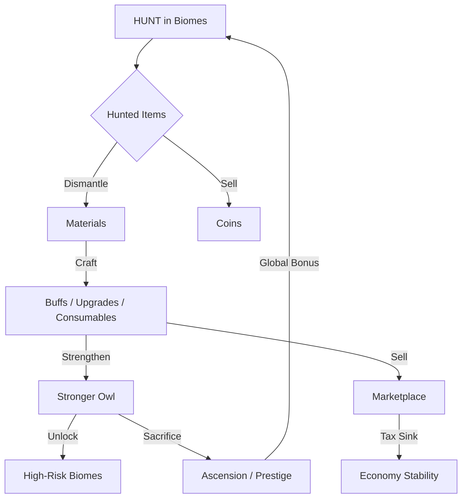

# BaykusBot - Sistem Tasarımı ve Analiz Raporu

Bu doküman, BaykusBot'un mevcut oyun mekaniklerini analiz eder ve hedeflenen "Hunt -> Craft -> Upgrade" döngüsünü kurmak için gerekli mimari değişiklikleri detaylandırır.

---

## 1. Current System Mapping (Mevcut Durum)

### A) Mevcut Sistem Akışı
- **HUNT:** Oyuncu `owl hunt` yapar. 10s cooldown. Statlara göre rastgele hayvan yakalanır. Hayvanlar envantere "Av" tipinde eklenir. Tek gelir kaynağı avları satmaktır.
- **TAME:** Avlanma sırasında %0.5 - %15 arası şansla bir encounter tetiklenir. Yabani baykuş evcilleştirilmeye çalışılır.
- **UPGRADE:** Avlardan düşen materyaller ve coin harcanarak baykuşun 5 statı (Gaga, Göz, Kulak, Kanat, Pençe) geliştirilir. Statlar 1-100 arasıdır.
- **ECONOMY:** Temel coin girişi Hunt ve PvP'den gelir. Temel çıkış (sink) ise Upgrade, Switch maliyeti ve Tamir'dir.

### B) Teknik Mimari
- **Config-Driven:** Tüm formüller ve sabitler `src/config.ts` içindedir.
- **Prisma & Redis:** Kalıcı veri MongoDB'de, geçici veriler (cooldown, session) Redis'tedir.
- **Locking:** `withLock` mekanizması ile race-condition önlenmektedir.

---

## 2. Problem Breakdown (Kritik Sorunlar)

1.  **Linear Gameplay:** Avlanan hayvanlar sadece satılıyor. Crafting olmadığı için "materyal toplama" motivasyonu zayıf.
2.  **Hunt Monotony:** Hunt tek buton ve tek mekanik. Stratejik derinlik yok.
3.  **Economy Inflation:** Coin girişi (Hunt/PvP) çıkışından (Upgrade/Tamir) daha hızlı artma eğiliminde.
4.  **Content Underutilization:** Tame en güçlü sistem olmasına rağmen encounter şansı düşük olduğu için en az kullanılan içerik.
5.  **Retention:** Daily streak dışında oyuncuyu uzun vadede bağlayan bir "prestige" veya "meta-progression" yok.

---

## 3. New System Architecture (Yeni Mimari Plan)

### A) Hunt Biyomları (Stratejik Derinlik)
Hunt artık tek bir havuzdan değil, biyom seçimli olacak.
- **Deep Forest (Derin Orman):** Yüksek risk (düşük catch chance), yüksek nadir drop.
- **Lake Side (Göl Kenarı):** Düşük risk (yüksek catch chance), stabil coin kazancı.
- **Biyom Giriş Ücreti:** Bazı biyomlar coin veya stat threshold gerektirecek.

### B) Crafting & Dismantle (Core Loop)
- **Dismantle:** Avlanan hayvanlar coin karşılığı satılmak yerine "parçalanarak" materyal verecek.
- **Crafting:** Toplanan materyallerle `buff`, `item`, `consumable` ve `prestige key` üretilecek.
- **Recipe System:** `config.ts` içinde tanımlı, ancak ileride DB'ye taşınmaya uygun interface.

### C) Global Marketplace (Ekonomi Kontrolü)
- **Anti-Abuse:** Alt-account farming'i engellemek için:
    - Minimum Level 15 zorunluluğu.
    - Satışlarda kademeli vergi (Tax).
    - Günlük limitler ve listing cooldown.
    - Min/Max fiyat koridoru.

---

## 4. Feature-by-Feature Integration Plan

| Feature | Değişecek Dosyalar | Mevcut Sistem Bağlantısı | Risk |
| :--- | :--- | :--- | :--- |
| **Dismantle** | `systems/economy.ts`, `commands/owl.ts` | Envanter sistemiyle doğrudan bağlı. | Yanlış item silinme riski. |
| **Crafting** | `systems/crafting.ts` (Yeni), `config.ts` | Materyal tüketimi ve envanter. | Recipe hataları, ekonomi dengesi. |
| **Biomes** | `systems/hunt.ts`, `config.ts`, `commands/owl.ts` | Hunt motoru biyom parametresi alacak. | Catch chance dengesinin bozulması. |
| **Market** | `systems/market.ts` (Yeni), `schema.prisma` | Yeni DB tabloları gerektirir. | **Kritik:** Alt-account abuse, coin transfer exploit. |
| **Prestige** | `systems/prestige.ts` (Yeni), `schema.prisma` | Baykuş resetleme ve kalıcı bufflar. | "Sonsuz scaling" riski, stat cap hataları. |
| **Quests** | `systems/daily-quests.ts` (Yeni) | Hunt, Craft, Tame aksiyonlarını dinler. | Ödül duplikasyonu. |

---

## 5. Exploit / Abuse Risk Report

1.  **Alt-Account Farming (Market):** Oyuncu yan hesabından ana hesabına ucuza item aktarabilir.
    - *Önlem:* Global Marketplace (direkt trade yok), listing tax ve min-price limit.
2.  **Reward Duplication (Craft):** Aynı anda iki craft emri gönderilerek materyal duplikasyonu.
    - *Önlem:* `withLock(playerId, 'craft')` kullanımı.
3.  **Biome Exploit:** Düşük seviyeli bir baykuşla yüksek biyomda şans eseri çok değerli drop almak.
    - *Önlem:* Biyomlara stat threshold ve entry cost eklenmesi.
4.  **Inflation Loop:** Craft edilen itemların çok ucuza satılıp marketi çökertmesi.
    - *Önlem:* Itemlara "Fixed Sell Price" değil, market talebine göre vergi.

---

## 6. Final Unified Game Loop Design

---

## 7. Implementation Priority Order (Yol Haritası)

1.  **PHASE 1: Core Loop (Dismantle & Craft)**
    - Avlanan itemları parçalama mekaniği.
    - Temel recipe sistemi ve crafting UI.
2.  **PHASE 2: Hunt Biomes**
    - Hunt motorunun biyom desteğiyle güncellenmesi.
    - Biyom seçim ekranı.
3.  **PHASE 3: Marketplace**
    - DB şeması güncellenmesi.
    - Abuse korumalı listing sistemi.
4.  **PHASE 4: Prestige & Quests**
    - Ascension mekaniği.
    - Günlük görev sistemi.
